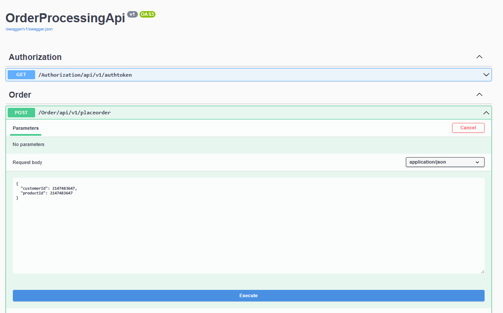

# ApiCallingOtherApis
This repo includes frontend api that consumes othe backend api (downstream apis)

The Frontend API which is secured via OAuth using OKTA. 

## Getting Started

To set up the solution, floow the below steps.
Have installed and running:
 - Visual Studio 2022, with .Net 7
 - Setup OKTA account (used the developer version registration)

## Get/Build code

```
git clone https://github.com/laxmanAdhikari/ApiCallingOtherApis.git

```
Open the solution[ApiCallingOtherApis.sln] using visual studio 2022 in the root of the folder ApiCallingOtherApis. 
Right click Solution => Properties => Select Multiple startup ptojects
OrderProcessingApi (FrontEndApi)
PrderProcessing.CustomerAPi (BackEndApi One)
OrderProcessing.ProductApi (BackendApi two)

## Environment Variables
Use .env file to run the solution. 
```
Please replace the following environment values. In order to bypass the security use BYPASS_SECURIT to 1 otherwise assign 0 and provide other values.

# Environment variables
CLIENT-ID=client-id
CLIENT-SECRECT=client-secrect
AUDIENCE=audience
GRANT-TYPE=grant-type
TOKEN-URL=token-url
BYPASS_SECURITY=1
```

``` =========  Running application ====================
On running via visual studio, the three browser window will be opened with swagger UI with all the API endpoints

1 FrontEndPAi (http://localhost:8080/swagger/index.html)


Click /Order/api/v1/placeorder and exdecute it.

2 BackendApiOne (http://localhost:8081/swagger/index.html)


3 BackendApiTwo (http://localhost:8082/swagger/index.html)


```` ======================================================

``` ===== Running Unit tests ========================
Open tests from Test => Test Explorer
The following tests will be visible.


```` ===============================================
